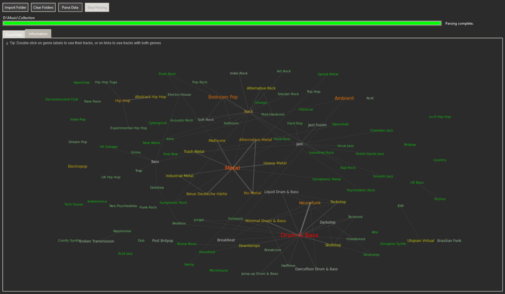
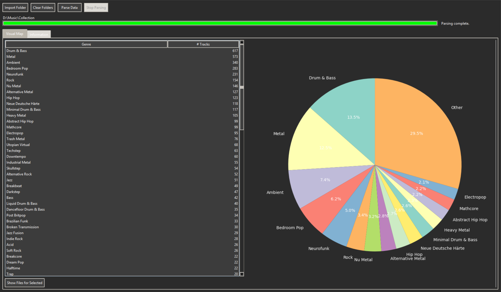
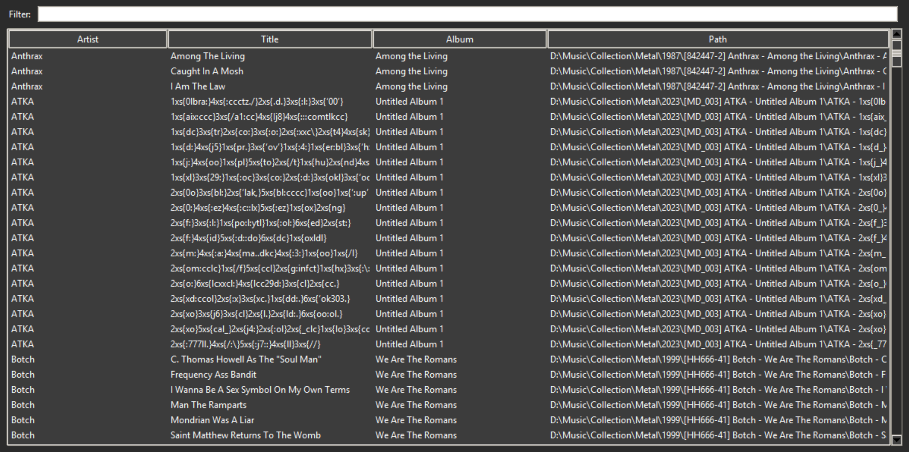

# Genre-o-Node

A desktop tool for visualizing music genre distributions across your audio library. Inspired by Every Noise at Once, Genre-o-Node scans your music collection and creates an interactive map showing how different genres relate to each other.

## What it does

Genre-o-Node reads genre tags from your audio files and builds a network visualization where:
- Genres with many tracks appear larger and in warmer colors (red)
- Genres with fewer tracks are smaller and cooler (green)
- Lines connect genres that frequently appear together on the same tracks
- You can double-click on any genre or link to see the actual files
- You can zoom in/out to better visualize data.

## Requirements

- Consistency across genres on the metadata (i.e. avoid simultaneously having tags such as "Drum & Bass" and "Drum and Bass")
- Keep tags with multiple genres/ genre and subgenre separated by semicolon (;) - can add support for morer separators later (e.g. "Metal; Heavy Metal; Nu Metal)

## Screenshots


*Interactive genre map with force-directed layout*


*Genre statistics and distribution chart*


*Detailed track listing for selected genres*

## Installation

Install the required dependencies:

```bash
pip install mutagen matplotlib
```

## Usage

Run the application:

```bash
python main.py
```

1. Click "Import Folder" to select your music library
2. Click "Parse Data" to scan all audio files
3. Explore the visual map or browse the information tab
4. Double-click genres or connections to see track details

## Supported Formats

MP3, FLAC, M4A, MP4, OGG, WAV, AIFF, WV, APE

## Features

- Force-directed layout clustering similar genres together
- Interactive zoom and pan on the visual map
- Sortable and filterable track listings
- Support for multiple music folders

